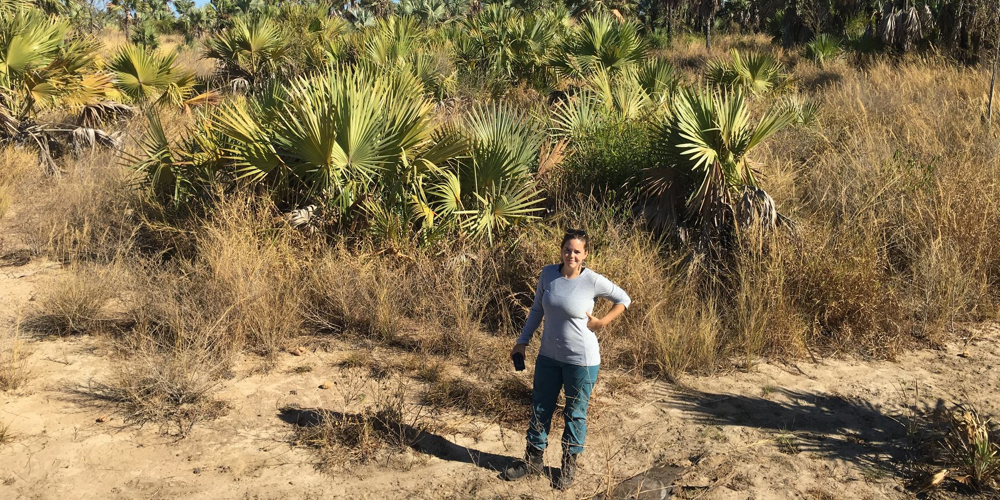

# Research page redesign — how to apply

Four files here:

    research.html               REPLACE — now a short overview + 3-card grid
    research-evolution.html     NEW — "Biodiversity patterns & evolution"
    research-genetics.html      NEW — "Genetic diversity & population change"
    research-conservation.html  NEW — "Biodiversity change & conservation"
    assets/css/style.css        REPLACE — same as before, plus the card-grid styles at the end

Copy these into your repo, overwriting `research.html` and `assets/css/style.css`,
adding the three new files alongside your other pages (same folder as
`research.html`, not in a subfolder). Then:

    git add -A
    git commit -m "Research: three-line overview with dedicated pages"
    git push

## What moved where

Your old research.html had five sections. They're now split up:

- "Ghosts of the megafauna" + "Fieldwork"  → research-evolution.html
- "Genomes, maps and the tools in between" → research-genetics.html
- "Where species disappear first"          → research-conservation.html (plus
  a new short paragraph mentioning the VascularPlantsNRL database)
- "Methods & tools" was split: the genomics-specific tools list moved into
  research-genetics.html; the spatial/lab/computing parts, which apply across
  all three lines, stayed on the research.html overview page.

Nothing was deleted — every sentence from the old page is still here somewhere.

## Changing a card's photo or destination

In research.html, each card is one block like this:

    <a class="rline" href="research-evolution.html">
      
      <h3>Biodiversity patterns &amp; evolution</h3>
      
How interactions, ecological strategies...

    </a>

Swap the `src` for a different photo already in `assets/img/`, or the `href`
to point somewhere else. The photos currently used are re-used from the
homepage header — feel free to add three new topic-specific ones instead
(same sizing note as before: roughly 4:3, doesn't need to be huge).
